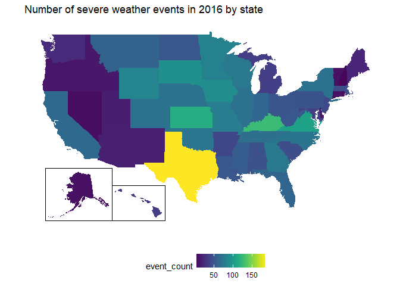

Portland Data Science Group historical severe weather data visualization workshop
================

``` r
library(tidyverse)
library(fiftystater)
library(maps)
library(mapproj)
library(viridis)
library(ggmap)
library(plotly)
```

``` r
# Portland Data Science Group data: https://drive.google.com/drive/folders/1JK1Oo6a85ZvEs1f3MM3wcGzCSAskXd-4
# NOAA website: https://www.ncdc.noaa.gov/stormevents/

# Jonathan Mackrory - event_reduced = broader groupings of events; also did some other cleanup

weather_trim3 <- read.csv("detail_trim3.csv")
```

``` r
# number of rain events per state
# fiftystates needs lowercase state names
# plotly needs state abbreviations

weather_trim3 <- weather_trim3 %>%
  mutate(state = tolower(STATE))
```

    ## Warning: package 'bindrcpp' was built under R version 3.4.4

``` r
state_abbs <- data.frame(STATE = toupper(state.name), state.abb)

weather_trim3 <- left_join(weather_trim3, state_abbs)
```

    ## Joining, by = "STATE"

    ## Warning: Column `STATE` joining factors with different levels, coercing to
    ## character vector

``` r
# Making static ggplot choropleth

# code from fiftystater vignette: https://cran.r-project.org/web/packages/fiftystater/vignettes/fiftystater.html


all_2016_ggplot <- weather_trim3 %>%
  filter(YEAR == 2016) %>%
  group_by(STATE, state, YEAR) %>%
  summarize(event_count = n()) %>%
  ggplot(aes(map_id = state)) +
  geom_map(aes(fill = event_count), map = fifty_states) + 
  expand_limits(x = fifty_states$long, y = fifty_states$lat) +
  coord_map() +
  scale_x_continuous(breaks = NULL) + 
  scale_y_continuous(breaks = NULL) +
  labs(x = "", y = "") +
  theme(legend.position = "bottom", 
        panel.background = element_blank()) +
  fifty_states_inset_boxes() +
  ggtitle("Number of severe weather events in 2016 by state") +
  scale_fill_viridis()

all_2016_ggplot
```



``` r
ggsave("all_weather.png", all_2016_ggplot)
```

    ## Saving 7 x 5 in image

``` r
# Making interactive plotly map

# filter data first, then do plotly (doesn't seem to work with filter piped directly into plotly)

# prepare columns adding indirect/direct injuries, indirect/direct deaths, property/crop damage

weather_trim3 <- weather_trim3 %>% 
  mutate(INJURIES_ALL = rowSums(weather_trim3[ ,14:15], na.rm = TRUE),
         DEATHS_ALL = rowSums(weather_trim3[ ,16:17], na.rm = TRUE),
         DAMAGE_ALL = rowSums(weather_trim3[ ,18:19], na.rm = TRUE))

# filter year and add number of event and sums of injuries, deaths, damage

plotly_2016_data <- weather_trim3 %>%
  filter(YEAR == 2016) %>%
  group_by(state.abb) %>%
  summarize(event_count = n(), Injuries_total = sum(INJURIES_ALL), Deaths_total = sum(DEATHS_ALL), Damage_total = sum(DAMAGE_ALL))

# add hover column for mouse-over text
# use prettyNum to add commas to dollar amounts

plotly_2016_data$hover <- c(paste0(plotly_2016_data$state.abb,
                                   "\nInjuries = ", plotly_2016_data$Injuries_total, 
                                "\nDeaths = ", plotly_2016_data$Deaths_total, 
                                "\nDamage = $", prettyNum(plotly_2016_data$Damage_total, big.mark = ",", scientific = FALSE, trim = TRUE)))
```

``` r
plotly_2016 <- plot_ly(plotly_2016_data, type = "choropleth", 
        locations = plotly_2016_data$state.abb,
        locationmode = "USA-states",
        z = plotly_2016_data$event_count, text = plotly_2016_data$hover) %>%
  layout(geo = list(scope = "usa"), title = "All weather events in 2016 by state")

htmlwidgets::saveWidget(plotly_2016, "plotly_2016_weather.html")

plotly_2016
```

<!--html_preserve-->

<script type="application/json" data-for="4eec7b8872ab">{"x":{"visdat":{"4eec27ba3143":["function () ","plotlyVisDat"]},"cur_data":"4eec27ba3143","attrs":{"4eec27ba3143":{"locations":["AK","AL","AR","AZ","CA","CO","CT","DE","FL","GA","HI","IA","ID","IL","IN","KS","KY","LA","MA","MD","ME","MI","MN","MO","MS","MT","NC","ND","NE","NH","NJ","NM","NV","NY","OH","OK","OR","PA","RI","SC","SD","TN","TX","UT","VA","VT","WA","WI","WV","WY",null],"locationmode":"USA-states","z":[9,48,41,18,64,71,10,14,61,75,35,91,14,70,62,116,127,51,44,36,21,35,82,79,55,59,72,51,70,5,42,18,8,70,50,73,13,49,7,45,93,68,185,17,106,9,24,75,51,85,132],"text":["AK<br />Injuries = 0<br />Deaths = 2<br />Damage = $1,000","AL<br />Injuries = 0<br />Deaths = 0<br />Damage = $30,400","AR<br />Injuries = 0<br />Deaths = 0<br />Damage = $500,000","AZ<br />Injuries = 0<br />Deaths = 0<br />Damage = $34,000","CA<br />Injuries = 3<br />Deaths = 1<br />Damage = $433,000","CO<br />Injuries = 0<br />Deaths = 0<br />Damage = $21,000","CT<br />Injuries = 0<br />Deaths = 0<br />Damage = $88,000","DE<br />Injuries = 0<br />Deaths = 0<br />Damage = $0","FL<br />Injuries = 3<br />Deaths = 5<br />Damage = $32,996,000","GA<br />Injuries = 5<br />Deaths = 0<br />Damage = $450,000","HI<br />Injuries = 0<br />Deaths = 0<br />Damage = $0","IA<br />Injuries = 0<br />Deaths = 0<br />Damage = $1,262,000","ID<br />Injuries = 0<br />Deaths = 0<br />Damage = $9,000","IL<br />Injuries = 0<br />Deaths = 1<br />Damage = $573,000","IN<br />Injuries = 0<br />Deaths = 1<br />Damage = $164,250","KS<br />Injuries = 3<br />Deaths = 0<br />Damage = $648,900","KY<br />Injuries = 22<br />Deaths = 2<br />Damage = $2,387,320","LA<br />Injuries = 77<br />Deaths = 6<br />Damage = $3,480,925,000","MA<br />Injuries = 0<br />Deaths = 0<br />Damage = $348,700","MD<br />Injuries = 0<br />Deaths = 0<br />Damage = $515,000","ME<br />Injuries = 0<br />Deaths = 0<br />Damage = $0","MI<br />Injuries = 0<br />Deaths = 0<br />Damage = $44,000","MN<br />Injuries = 3<br />Deaths = 2<br />Damage = $110,000","MO<br />Injuries = 0<br />Deaths = 2<br />Damage = $81,000","MS<br />Injuries = 2<br />Deaths = 0<br />Damage = $1,153,000","MT<br />Injuries = 0<br />Deaths = 1<br />Damage = $5,000","NC<br />Injuries = 0<br />Deaths = 1<br />Damage = $1,291,000","ND<br />Injuries = 0<br />Deaths = 0<br />Damage = $50,645,000","NE<br />Injuries = 0<br />Deaths = 0<br />Damage = $2,636,000","NH<br />Injuries = 0<br />Deaths = 0<br />Damage = $0","NJ<br />Injuries = 0<br />Deaths = 0<br />Damage = $66,500","NM<br />Injuries = 0<br />Deaths = 1<br />Damage = $1,030,000","NV<br />Injuries = 0<br />Deaths = 0<br />Damage = $25,000","NY<br />Injuries = 0<br />Deaths = 1<br />Damage = $748,000","OH<br />Injuries = 0<br />Deaths = 0<br />Damage = $1,115,500","OK<br />Injuries = 1<br />Deaths = 0<br />Damage = $1,031,000","OR<br />Injuries = 0<br />Deaths = 1<br />Damage = $18,000","PA<br />Injuries = 0<br />Deaths = 0<br />Damage = $564,000","RI<br />Injuries = 0<br />Deaths = 0<br />Damage = $20,900","SC<br />Injuries = 2<br />Deaths = 0<br />Damage = $68,478,500","SD<br />Injuries = 0<br />Deaths = 0<br />Damage = $82,000","TN<br />Injuries = 0<br />Deaths = 0<br />Damage = $148,000","TX<br />Injuries = 0<br />Deaths = 3<br />Damage = $53,559,000","UT<br />Injuries = 0<br />Deaths = 0<br />Damage = $50,000","VA<br />Injuries = 0<br />Deaths = 0<br />Damage = $3,886,500","VT<br />Injuries = 0<br />Deaths = 0<br />Damage = $40,000","WA<br />Injuries = 0<br />Deaths = 1<br />Damage = $217,200","WI<br />Injuries = 0<br />Deaths = 2<br />Damage = $10,994,000","WV<br />Injuries = 5<br />Deaths = 0<br />Damage = $4,246,500","WY<br />Injuries = 2<br />Deaths = 0<br />Damage = $501,200","NA<br />Injuries = 0<br />Deaths = 1<br />Damage = $6,000"],"alpha":1,"sizes":[10,100],"type":"choropleth"}},"layout":{"margin":{"b":40,"l":60,"t":25,"r":10},"geo":{"scope":"usa"},"title":"All weather events in 2016 by state","xaxis":{"domain":[0,1]},"yaxis":{"domain":[0,1]},"hovermode":"closest","showlegend":false,"legend":{"y":0.5,"yanchor":"top"}},"source":"A","config":{"modeBarButtonsToAdd":[{"name":"Collaborate","icon":{"width":1000,"ascent":500,"descent":-50,"path":"M487 375c7-10 9-23 5-36l-79-259c-3-12-11-23-22-31-11-8-22-12-35-12l-263 0c-15 0-29 5-43 15-13 10-23 23-28 37-5 13-5 25-1 37 0 0 0 3 1 7 1 5 1 8 1 11 0 2 0 4-1 6 0 3-1 5-1 6 1 2 2 4 3 6 1 2 2 4 4 6 2 3 4 5 5 7 5 7 9 16 13 26 4 10 7 19 9 26 0 2 0 5 0 9-1 4-1 6 0 8 0 2 2 5 4 8 3 3 5 5 5 7 4 6 8 15 12 26 4 11 7 19 7 26 1 1 0 4 0 9-1 4-1 7 0 8 1 2 3 5 6 8 4 4 6 6 6 7 4 5 8 13 13 24 4 11 7 20 7 28 1 1 0 4 0 7-1 3-1 6-1 7 0 2 1 4 3 6 1 1 3 4 5 6 2 3 3 5 5 6 1 2 3 5 4 9 2 3 3 7 5 10 1 3 2 6 4 10 2 4 4 7 6 9 2 3 4 5 7 7 3 2 7 3 11 3 3 0 8 0 13-1l0-1c7 2 12 2 14 2l218 0c14 0 25-5 32-16 8-10 10-23 6-37l-79-259c-7-22-13-37-20-43-7-7-19-10-37-10l-248 0c-5 0-9-2-11-5-2-3-2-7 0-12 4-13 18-20 41-20l264 0c5 0 10 2 16 5 5 3 8 6 10 11l85 282c2 5 2 10 2 17 7-3 13-7 17-13z m-304 0c-1-3-1-5 0-7 1-1 3-2 6-2l174 0c2 0 4 1 7 2 2 2 4 4 5 7l6 18c0 3 0 5-1 7-1 1-3 2-6 2l-173 0c-3 0-5-1-8-2-2-2-4-4-4-7z m-24-73c-1-3-1-5 0-7 2-2 3-2 6-2l174 0c2 0 5 0 7 2 3 2 4 4 5 7l6 18c1 2 0 5-1 6-1 2-3 3-5 3l-174 0c-3 0-5-1-7-3-3-1-4-4-5-6z"},"click":"function(gd) { \n        // is this being viewed in RStudio?\n        if (location.search == '?viewer_pane=1') {\n          alert('To learn about plotly for collaboration, visit:\\n https://cpsievert.github.io/plotly_book/plot-ly-for-collaboration.html');\n        } else {\n          window.open('https://cpsievert.github.io/plotly_book/plot-ly-for-collaboration.html', '_blank');\n        }\n      }"}],"cloud":false},"data":[{"colorbar":{"title":"","ticklen":2,"len":0.5,"y":1,"lenmode":"fraction","yanchor":"top"},"colorscale":[["0","rgba(68,1,84,1)"],["0.0171296296296296","rgba(69,8,89,1)"],["0.0231481481481481","rgba(69,11,91,1)"],["0.0458333333333333","rgba(70,20,99,1)"],["0.0555555555555555","rgba(71,23,102,1)"],["0.0722222222222222","rgba(71,29,107,1)"],["0.0972222222222222","rgba(72,36,115,1)"],["0.166666666666667","rgba(68,58,128,1)"],["0.190740740740741","rgba(66,65,132,1)"],["0.213888888888889","rgba(63,72,136,1)"],["0.236111111111111","rgba(61,78,138,1)"],["0.249537037037037","rgba(60,82,138,1)"],["0.255555555555556","rgba(59,83,139,1)"],["0.27962962962963","rgba(57,90,140,1)"],["0.312037037037037","rgba(53,98,141,1)"],["0.333333333333333","rgba(49,104,142,1)"],["0.361111111111111","rgba(47,110,142,1)"],["0.363425925925926","rgba(47,111,142,1)"],["0.375","rgba(46,114,142,1)"],["0.388888888888889","rgba(45,117,142,1)"],["0.422222222222222","rgba(41,125,142,1)"],["0.469444444444444","rgba(38,136,141,1)"],["0.549074074074074","rgba(32,156,137,1)"],["0.672685185185185","rgba(57,184,119,1)"],["1","rgba(253,231,37,1)"]],"showscale":true,"locations":["AK","AL","AR","AZ","CA","CO","CT","DE","FL","GA","HI","IA","ID","IL","IN","KS","KY","LA","MA","MD","ME","MI","MN","MO","MS","MT","NC","ND","NE","NH","NJ","NM","NV","NY","OH","OK","OR","PA","RI","SC","SD","TN","TX","UT","VA","VT","WA","WI","WV","WY",null],"locationmode":"USA-states","z":[9,48,41,18,64,71,10,14,61,75,35,91,14,70,62,116,127,51,44,36,21,35,82,79,55,59,72,51,70,5,42,18,8,70,50,73,13,49,7,45,93,68,185,17,106,9,24,75,51,85,132],"text":["AK<br />Injuries = 0<br />Deaths = 2<br />Damage = $1,000","AL<br />Injuries = 0<br />Deaths = 0<br />Damage = $30,400","AR<br />Injuries = 0<br />Deaths = 0<br />Damage = $500,000","AZ<br />Injuries = 0<br />Deaths = 0<br />Damage = $34,000","CA<br />Injuries = 3<br />Deaths = 1<br />Damage = $433,000","CO<br />Injuries = 0<br />Deaths = 0<br />Damage = $21,000","CT<br />Injuries = 0<br />Deaths = 0<br />Damage = $88,000","DE<br />Injuries = 0<br />Deaths = 0<br />Damage = $0","FL<br />Injuries = 3<br />Deaths = 5<br />Damage = $32,996,000","GA<br />Injuries = 5<br />Deaths = 0<br />Damage = $450,000","HI<br />Injuries = 0<br />Deaths = 0<br />Damage = $0","IA<br />Injuries = 0<br />Deaths = 0<br />Damage = $1,262,000","ID<br />Injuries = 0<br />Deaths = 0<br />Damage = $9,000","IL<br />Injuries = 0<br />Deaths = 1<br />Damage = $573,000","IN<br />Injuries = 0<br />Deaths = 1<br />Damage = $164,250","KS<br />Injuries = 3<br />Deaths = 0<br />Damage = $648,900","KY<br />Injuries = 22<br />Deaths = 2<br />Damage = $2,387,320","LA<br />Injuries = 77<br />Deaths = 6<br />Damage = $3,480,925,000","MA<br />Injuries = 0<br />Deaths = 0<br />Damage = $348,700","MD<br />Injuries = 0<br />Deaths = 0<br />Damage = $515,000","ME<br />Injuries = 0<br />Deaths = 0<br />Damage = $0","MI<br />Injuries = 0<br />Deaths = 0<br />Damage = $44,000","MN<br />Injuries = 3<br />Deaths = 2<br />Damage = $110,000","MO<br />Injuries = 0<br />Deaths = 2<br />Damage = $81,000","MS<br />Injuries = 2<br />Deaths = 0<br />Damage = $1,153,000","MT<br />Injuries = 0<br />Deaths = 1<br />Damage = $5,000","NC<br />Injuries = 0<br />Deaths = 1<br />Damage = $1,291,000","ND<br />Injuries = 0<br />Deaths = 0<br />Damage = $50,645,000","NE<br />Injuries = 0<br />Deaths = 0<br />Damage = $2,636,000","NH<br />Injuries = 0<br />Deaths = 0<br />Damage = $0","NJ<br />Injuries = 0<br />Deaths = 0<br />Damage = $66,500","NM<br />Injuries = 0<br />Deaths = 1<br />Damage = $1,030,000","NV<br />Injuries = 0<br />Deaths = 0<br />Damage = $25,000","NY<br />Injuries = 0<br />Deaths = 1<br />Damage = $748,000","OH<br />Injuries = 0<br />Deaths = 0<br />Damage = $1,115,500","OK<br />Injuries = 1<br />Deaths = 0<br />Damage = $1,031,000","OR<br />Injuries = 0<br />Deaths = 1<br />Damage = $18,000","PA<br />Injuries = 0<br />Deaths = 0<br />Damage = $564,000","RI<br />Injuries = 0<br />Deaths = 0<br />Damage = $20,900","SC<br />Injuries = 2<br />Deaths = 0<br />Damage = $68,478,500","SD<br />Injuries = 0<br />Deaths = 0<br />Damage = $82,000","TN<br />Injuries = 0<br />Deaths = 0<br />Damage = $148,000","TX<br />Injuries = 0<br />Deaths = 3<br />Damage = $53,559,000","UT<br />Injuries = 0<br />Deaths = 0<br />Damage = $50,000","VA<br />Injuries = 0<br />Deaths = 0<br />Damage = $3,886,500","VT<br />Injuries = 0<br />Deaths = 0<br />Damage = $40,000","WA<br />Injuries = 0<br />Deaths = 1<br />Damage = $217,200","WI<br />Injuries = 0<br />Deaths = 2<br />Damage = $10,994,000","WV<br />Injuries = 5<br />Deaths = 0<br />Damage = $4,246,500","WY<br />Injuries = 2<br />Deaths = 0<br />Damage = $501,200","NA<br />Injuries = 0<br />Deaths = 1<br />Damage = $6,000"],"type":"choropleth","frame":null}],"highlight":{"on":"plotly_click","persistent":false,"dynamic":false,"selectize":false,"opacityDim":0.2,"selected":{"opacity":1}},"base_url":"https://plot.ly"},"evals":["config.modeBarButtonsToAdd.0.click"],"jsHooks":{"render":[{"code":"function(el, x) { var ctConfig = crosstalk.var('plotlyCrosstalkOpts').set({\"on\":\"plotly_click\",\"persistent\":false,\"dynamic\":false,\"selectize\":false,\"opacityDim\":0.2,\"selected\":{\"opacity\":1}}); }","data":null}]}}</script>
<!--/html_preserve-->
``` r
## Next step - make Shiny app with years, other info
```
